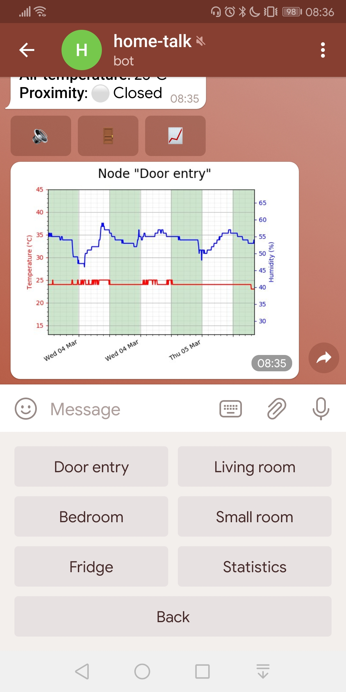
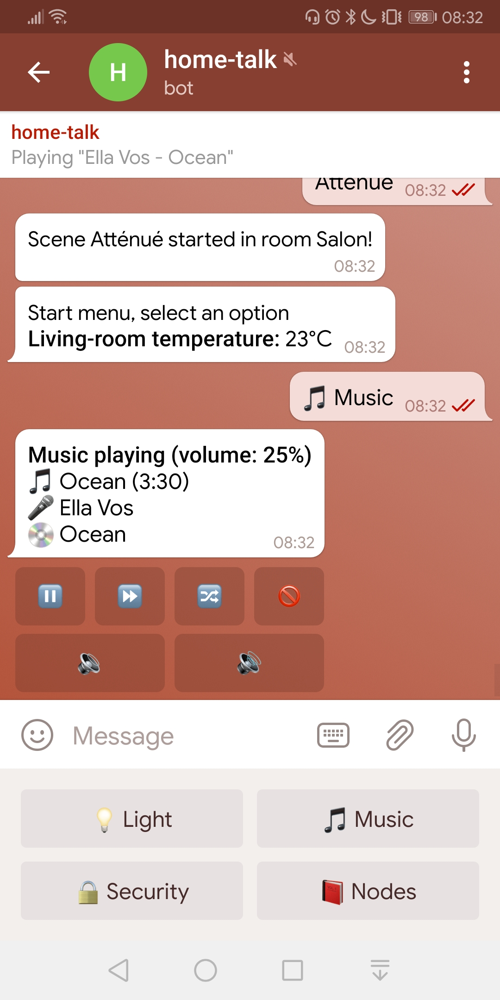
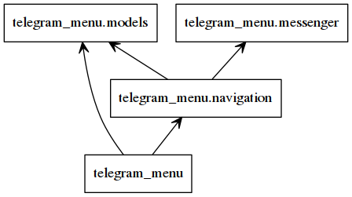
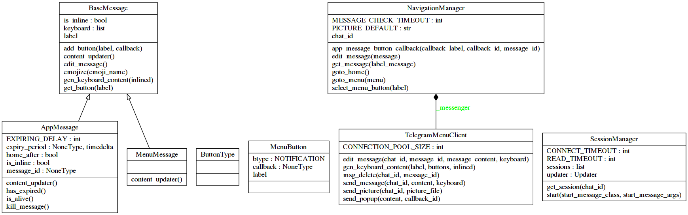

# telegram_menu package

A python library for generating Telegram navigation menu and application messages.

Base classes `MenuMessage` and `AppMessage` define buttons to execute application 
callbacks and nevigate to chained messages. 

Features:

* Menu navigation using tree structure, unlimited depth
* Support for sending pictures, notifications, and polls
* Session manager when multiple users connect to the same bot
* Automatic deletion of messages when configurable timer has expired
* Integration of markdown format + emojis

     

## Installation

```bash
git clone https://github.com/mevellea/telegram_menu
cd telegram_menu
python setup.py install
```

## Getting Started

You first need to [create a Telegram bot](https://github.com/python-telegram-bot/python-telegram-bot/wiki/Introduction-to-the-API), then you can refer to sample code in ``tests\test_connection.py`` to run a complete use-case.

Following code block creates a ``Hello, World!`` message:

```python
from telegram_menu import MenuMessage, SessionManager

API_KEY = "put_your_telegram_bot_api_key_here"

class StartMessage(MenuMessage):
    """Start menu, create all app sub-menus."""

    LABEL = "start"

    def __init__(self, navigation):
        """Init StartMessage class."""
        MenuMessage.__init__(self, navigation, StartMessage.LABEL)

    def content_updater(self):
        """Update message content."""
        return "Hello, world!"

SessionManager(API_KEY).start(StartMessagecal)
```

You can add any button in ``StartMessage``, using ``self.add_button()`` method:

```python
# run_and_notify() is a class method which runs something and returns a string as Telegram notification
self.add_button("Action", self.run_and_notify)

# new_menu is a class derived from MenuMessage or AppMessage, which will generate a new menu or app message
self.add_button("NewMenu", new_menu_app)
```

An application message can contain several inlined buttons, behavior is similar to MenuMessage buttons.

```python
# run_and_notify() is a class method which execute any python function returning a string as Telegram notification
self.add_button("Action", self.run_and_notify)

# get_content() is a class method which generates some text to display, eventually with markdown formatting
self.add_button("Display content", self.get_content, ButtonType.MESSAGE)

# get_picture() is a class method which returns the path of a picture to display
self.add_button("Show picture", self.get_picture, ButtonType.PICTURE)
```

## Structure

Classes in package ``telegram_menu`` are stored in 2 python files:

* [navigation.py](telegram_menu/navigation.py): main interface, menu and message generation and management
* [models.py](telegram_menu/models.py): menu and messages model, classes definition

 

Following class diagram describes all public interfaces:

 
